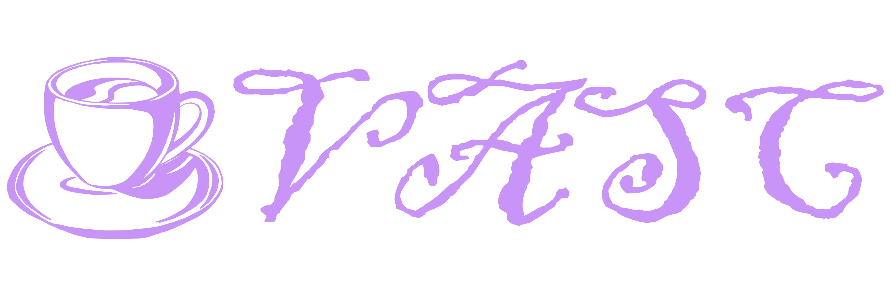

  
   
   
  <strong>Full featured tool for Roblox development</strong>
   
   
  
  

---

# VASC — VS Code Extension

VASC for Visual Studio Code is a user-friendly wrapper around the [VASC CLI](https://github.com/vadymcap/vasc), bringing the full Roblox development workflow directly into your editor without touching the terminal.

It is part of the VASC project, a fork of [Argon](https://github.com/argon-rbx/argon), extended with additional features and improvements.

## Related Packages

| Package | Description |
|---|---|
| [**vasc**](https://github.com/vadymcap/vasc) | Core CLI — handles all processing and syncing logic |
| **vasc-vscode** *(this repo)* | VS Code extension — GUI wrapper around the CLI |
| [**vasc-roblox**](https://github.com/vadymcap/vasc-roblox) | Studio plugin — required for live sync to function |

## Features

- **Two-way sync** — keep code and instance properties in sync between VS Code and Roblox Studio in real time
- **Project building** — compile projects into Roblox binary (`.rbxl`) or XML (`.rbxlx`) format directly from the editor
- **Integrated commands** — run all VASC CLI commands from the VS Code command palette or sidebar
- **Beginner and professional friendly** — sensible defaults out of the box, deep customization when you need it
- **Workflow automation** — CI/CD support for automated pipelines

## Requirements

- [VASC CLI](https://github.com/vadymcap/vasc) must be installed
- [VASC Roblox Plugin](https://github.com/vadymcap/vasc-roblox) must be installed in Roblox Studio for live sync

---

  VASC is a fork of <a href="https://github.com/argon-rbx/argon">Argon</a>, originally created by Dervex. Licensed under Apache 2.0.

